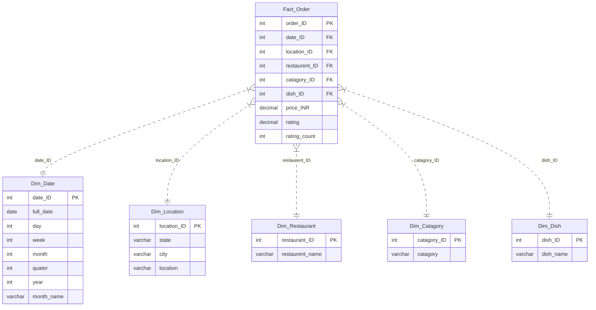

# Swiggy Sales Analysis Project 🍔📊

## Project Overview

This project presents a comprehensive data analysis of Swiggy sales data using Microsoft SQL Server. The goal is to derive actionable business insights by processing raw sales data through a structured pipeline: from data cleaning and validation to dimensional modeling and advanced business analytics, with optional visualization in Tableau.

## 📂 Project Structure

```text
SWIGGY_SALES_ANALYSIS
│
├── IMAGES /
│
├── 1_data_cleaning_and_validation.SQL
├── 2_create_star_schema.SQL
├── 3_KPIS.SQL
├── 4_Business_Analysis.SQL
│
├── data.csv
├── README.md
├── LICENSE

```

## 💾 Dataset Description

The analysis is based on the `data.csv` file, which includes detailed transaction records.

| Column | Description |
| :--- | :--- |
| **State** | State where the order was placed |
| **City** | City of the transaction |
| **Order Date** | Date the order was placed |
| **Restaurant Name** | Name of the restaurant |
| **Location** | Specific locality/area |
| **Category** | Food category (e.g., Snack, Recommended) |
| **Dish Name** | Name of the item ordered |
| **Price (INR)** | Cost of the item |
| **Rating** | Customer rating for the order |
| **Rating Count** | Count of ratings received |

---

## 🧹 1. Data Cleaning & Validation

Script: `1_data_cleaning_and_validation.SQL`

- NULL checks
- Empty string checks
- Duplicate detection
- Duplicate removal (if applicable)

---

## 🏗️ 2. Database Schema

The project follows a **Star Schema** architectural pattern to optimize for analytical queries.


|**Star Schema**| 
|------|
|  |




- **Fact table:** 
    - `Fact_Order`: contains measures like `price_INR`, `rating`, `rating_count`
- **Dimension tables:**
    - `Dim_Date`: temporal attributes (year, month, quarter)
    - `Dim_Location`: geography (state, city, location)
    - `Dim_Restaurant`: restaurant master
    - `Dim_Catagory`: category master
    - `Dim_Dish`: dish master

---

## 📈 3. KPIs

### 📊 Overall Business KPIs

- `Total Orders` - Count of all orders placed
- `Total Revenue (₹-M)` - Gross Merchandise Value (GMV) in INR Million
- `Average Order Value (AOV)` - Revenue per order
- `Orders per Day` - Daily order volume trends
- `Orders per Quarter` - Quarterly order distribution
- `Orders per Month` - Monthly order patterns
- `Revenue by Month` - Monthly revenue breakdown (base for growth metrics)
- `Month-over-Month (MoM) Revenue Growth %` - Monthly revenue change percentage
- `Quarter-over-Quarter (QoQ) Revenue Growth %` - Quarterly revenue change percentage

### 📍 Location Performance KPIs

- `Orders by Location (State / City)` - Order distribution across geography
- `Revenue by State / City` - Geographic revenue breakdown
- `Average Order Value (AOV) by Location` - Location-wise spending patterns
- `Location Revenue Contribution %` - Each location's share of total revenue
- `Top 10 Performing Cities (by Revenue)` - Best performing markets
- `Bottom 10 Performing Cities (by Revenue)` - Underperforming markets requiring attention

### 🍽️ Restaurant Performance KPIs

- `Orders per Restaurant` - Order volume by restaurant
- `Revenue per Restaurant` - Restaurant-wise revenue generation
- `Avg Revenue per Order per Restaurant (AOV)` - Restaurant-specific order value
- `Top 10 Restaurants' Share of Total Revenue` - Revenue concentration metric

### 🍕 Category-Based KPIs

- `Orders by Category` - Order distribution across food categories
- `Revenue by Category` - Category-wise revenue contribution
- `Category Mix %` - Percentage breakdown of revenue by category
- `Avg Price per Category (AOV by Category)` - Category-specific pricing insights

See [3_KPIS.SQL](3_KPIS.SQL) for detailed query implementations.

---

## 🔎 4. Business Analysis

Questions are listed in `4_Business_Analysis.SQL` (fill in your findings below as you analyze).

- `Which cities consistently outperform and deserve expansion budget?`

    - **Ans :**  *Cities like **Bengaluru**, **Lucknow**, **Hyderabad**, and **Mumbai** are performing well every month and bringing in high revenue, so they are good choices for expanding the business. On the other hand, cities like **Panaji** and **Lucknow** have higher average order values, which means customers there are willing to spend more, making these cities suitable for premium and high-margin offerings.*

    - |**Query Result**| 
      |------|
      |  |

- `Are we over-dependent on a few restaurants?`

    - **Ans :** *The business is not over-dependent on a few restaurants. While some large brands  contribute more revenue,like **KFC** contribute about **8%** of total revenue.A long tail of smaller restaurants collectively adds stability and reduces risk.*

    - |**Query Result**| 
      |------|
      |  |
      |  |

- `Which dishes are overpriced for demand?`

    - **Ans :** *Dishes such as **large combo meals**, **party packs**, and **deluxe thalis** are overpriced for their demand. These items have very high prices but receive very few orders, indicating that customers are **price-sensitive** and tend to avoid them unless it is for special occasions.*

    - |**Query Result**| 
      |------|
      |  |


- `When should operations scale up or down?`

    - **Ans :** *Orders and revenue are higher during certain months like **January**, **May**, and **August**, which means operations should scale up during these periods to handle higher demand. In months where orders and revenue dip slightly, operations can scale down to optimize costs.*

    - |**Query Result**| 
      |------|
      |  |

- `Weekend vs Weekday Behavior`

    - **Ans :** *Customers place many more orders on weekdays compared to weekends. However, the average order value is slightly higher on weekends, which means people tend to spend a bit more per order when they order on weekends.*

    - |**Query Result**| 
      |------|
      |  |

---

## 🚀 Getting Started

### ✅ Prerequisites

- Microsoft SQL Server
- SQL client: SSMS or Azure Data Studio
- (Optional) Tableau for visualization

### ▶️ Steps

1. Import `data.csv` into SQL Server (staging table expected as `dbo.[swiggy data]`).
2. Run `1_data_cleaning_and_validation.SQL`.
3. Run `2_create_star_schema.SQL` to create dimensions + fact table and load data.
4. Run `3_KPIS.SQL` for KPI outputs.
5. Run `4_Business_Analysis.SQL` to answer business questions.


## 🛠️ Tools & Technologies

- **Database:** Microsoft SQL Server
- **Language:** T-SQL
- **Concepts:** Data Cleaning, Normalization, Star Schema, Aggregation, Window Functions, CTE (Common Table Expression)

---

## 📄 License

This project is licensed under the MIT License - see the [LICENSE](LICENSE) file for details.


## 📬 Contact

**Project Maintainer**: [Rupam Mondal]
- 📧 Email: [Mail](rupam.mondal2022@uem.edu.in)
- 🐙 GitHub: [Link](https://github.com/RpM-999)
- 💼 LinkedIn: [Link](https://linkedin.com/in/rupam-mondal-data-science )

**Project Link**: [LINK](https://github.com/RpM-999/SQL-P1-SWIGGY_SALES_ANALYSIS)

---