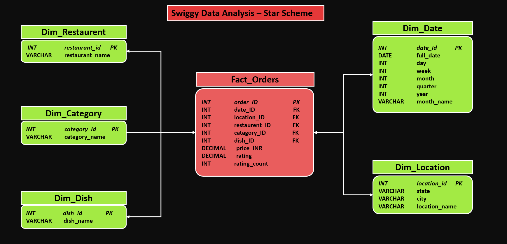
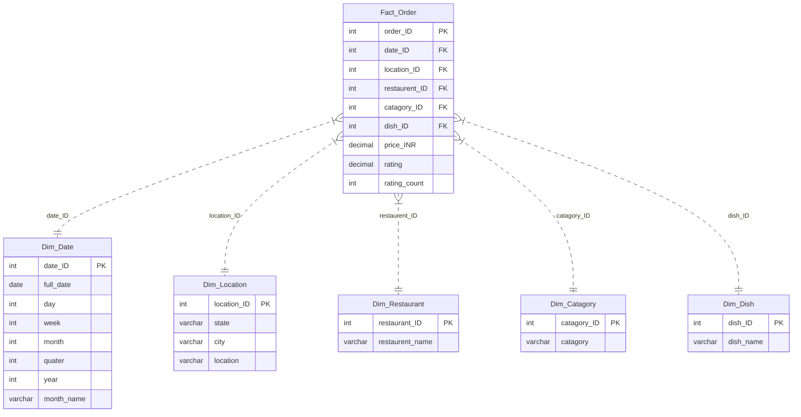

# Swiggy Sales Analysis Project 🍔📊

## Project Overview

This project presents a comprehensive data analysis of Swiggy sales data using Microsoft SQL Server. The goal is to derive actionable business insights by processing raw sales data through a structured pipeline: from data cleaning and validation to dimensional modeling and advanced business analytics, with optional visualization in Tableau.

## 📂 Project Structure

```text
SWIGGY_SALES_ANALYSIS
│
├── IMAGES /
│
├── 1_data_cleaning_and_validation.SQL
├── 2_create_star_schema.SQL
├── 3_KPIS.SQL
├── 4_Business_Analysis.SQL
│
├── data.csv
├── README.md
├── LICENSE

```

## 💾 Dataset Description

The analysis is based on the `data.csv` file, which includes detailed transaction records.

| Column | Description |
| :--- | :--- |
| **State** | State where the order was placed |
| **City** | City of the transaction |
| **Order Date** | Date the order was placed |
| **Restaurant Name** | Name of the restaurant |
| **Location** | Specific locality/area |
| **Category** | Food category (e.g., Snack, Recommended) |
| **Dish Name** | Name of the item ordered |
| **Price (INR)** | Cost of the item |
| **Rating** | Customer rating for the order |
| **Rating Count** | Count of ratings received |

---

## 🧹 1. Data Cleaning & Validation

Script: `1_data_cleaning_and_validation.SQL`

- NULL checks
- Empty string checks
- Duplicate detection
- Duplicate removal (if applicable)

---

## 🏗️ 2. Database Schema

The project follows a **Star Schema** architectural pattern to optimize for analytical queries.







- **Fact table:** `Fact_Order` (contains measures like `price_INR`, `rating`, `rating_count`)
- **Dimension tables:**
    - `Dim_Date`: temporal attributes (year, month, quarter)
    - `Dim_Location`: geography (state, city, location)
    - `Dim_Restaurant`: restaurant master
    - `Dim_Catagory`: category master
    - `Dim_Dish`: dish master

---

## 📈 3. KPIs

- **Order and revenue KPIs:**
    - `Total Orders`
    - `Total Revenue (₹, GMV)`
    - `Average Order Value (AOV)`
    - `Orders per Day`
    - `Orders per Quarter`
    - `Orders per Month`
    - `Revenue by Month (base for growth metrics)`
    - `Month-over-Month (MoM) Revenue Growth %`
    - `Quarter-over-Quarter (QoQ) Revenue Growth %`

- **Location KPIs**
    - `Orders by Location (State / City)`
    - `Revenue by State / City`
    - `Average Order Value (AOV) by Location`
    - `Location Revenue Contribution %`
    - `Top 10 Performing Cities (by Revenue)`
    - `Bottom 10 Performing Cities (by Revenue)`

- **Restaurant performance KPIs**

See `3_KPIS.SQL` for full queries.

---

## 🔎 4. Business Analysis

Questions are listed in `4_Business_Analysis.SQL` (fill in your findings below as you analyze).

- `Which cities consistently outperform and deserve expansion budget?`
    - Ans:
- `Are we over-dependent on a few restaurants?`
    - Ans:
- `Which dishes are overpriced for demand?`
    - Ans:
- `When should operations scale up or down?`
    - Ans:
- `Weekend vs Weekday Behavior`
    - Ans:
- `Which restaurants are revenue-positive but brand-negative?`
    - Ans:

---

## 🚀 Getting Started

### ✅ Prerequisites

- Microsoft SQL Server
- SQL client: SSMS or Azure Data Studio
- (Optional) Tableau for visualization

### ▶️ Steps

1. Import `data.csv` into SQL Server (staging table expected as `dbo.[swiggy data]`).
2. Run `1_data_cleaning_and_validation.SQL`.
3. Run `2_create_star_schema.SQL` to create dimensions + fact table and load data.
4. Run `3_KPIS.SQL` for KPI outputs.
5. Run `4_Business_Analysis.SQL` to answer business questions.


## 🛠️ Tools & Technologies

- **Database:** Microsoft SQL Server
- **Language:** T-SQL
- **Concepts:** Data Cleaning, Normalization, Star Schema, Aggregation, Window Functions, CTE (Common Table Expression)

---

## 📄 License

This project is licensed under the MIT License - see the [LICENSE](LICENSE) file for details.


## 📬 Contact

**Project Maintainer**: [Rupam Mondal]
- 📧 Email: [Mail](rupam.mondal2022@uem.edu.in)
- 🐙 GitHub: [Link](https://github.com/RpM-999)
- 💼 LinkedIn: [Link](https://linkedin.com/in/rupam-mondal-data-science )

**Project Link**: [LINK](https://github.com/RpM-999/SQL-P1-SWIGGY_SALES_ANALYSIS)

---